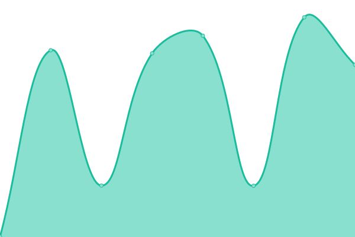

# [📈 Live Status](https://aarondoran.me): <!--live status--> **🟩 All systems operational**

This repository contains the open-source uptime monitor and status page for [Upptime](https://upptime.js.org), powered by [Upptime](https://github.com/upptime/upptime).

With [Upptime](https://upptime.js.org), you can get your own unlimited and free uptime monitor and status page, powered entirely by a GitHub repository. We use [Issues](https://github.com/upptime/upptime/issues) as incident reports, [Actions](https://github.com/Aarondoran/Uptime/actions) as uptime monitors, and [Pages](https://aarondoran.me) for the status page.

<!--start: status pages-->
<!-- This summary is generated by Upptime (https://github.com/upptime/upptime) -->
<!-- Do not edit this manually, your changes will be overwritten -->
<!-- prettier-ignore -->
| URL | Status | History | Response Time | Uptime |
| --- | ------ | ------- | ------------- | ------ |
|  [aarondoran.me](https://www.aarondoran.me) | 🟩 Up | [aarondoran-me.yml](https://github.com/Aarondoran/uptime/commits/HEAD/history/aarondoran-me.yml) | 

 474ms
     
 | 

<a href="https://uptime.aarondoran.me/history/aarondoran-me">100.00%</a>
    

|  [Node-url-shortener](https://Node-URL-shortener.vercel.app) | 🟩 Up | [node-url-shortener.yml](https://github.com/Aarondoran/uptime/commits/HEAD/history/node-url-shortener.yml) | 

 105ms
     
 | 

<a href="https://uptime.aarondoran.me/history/node-url-shortener">100.00%</a>
    

|  [ForgottenFiles](https://forgotten-files.vercel.app) | 🟩 Up | [forgotten-files.yml](https://github.com/Aarondoran/uptime/commits/HEAD/history/forgotten-files.yml) | 

 660ms
     
 | 

<a href="https://uptime.aarondoran.me/history/forgotten-files">100.00%</a>
    

<!--end: status pages-->

[**Visit our status website →**](https://aarondoran.me)

## 📄 License

- Powered by: [Upptime](https://github.com/upptime/upptime)
- Code: [MIT](./LICENSE) © [Anand Chowdhary](https://anandchowdhary.com), supported by [Pabio](https://pabio.com)
- Data in the `./history` directory: [Open Database License](https://opendatacommons.org/licenses/odbl/1-0/)
